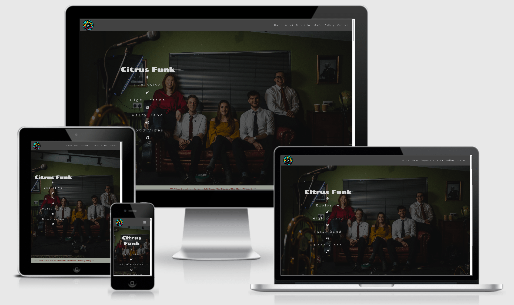

# [**Citrus Funk**](https://jjpickering10.github.io/CI-MS1-Citrus-Funk/)

*Use CTRL+click or CMD+click to open links throughout the README in a new tab*

## Overview

 Citrus Funk are a five-piece party band based in Leeds, United Kingdom.

---

## Description

This project is a site for my cousins band, Citrus Funk. It aims to promote their music and give them further exposure to help generate a larger fan base.

---

## UX

### User Stories

First Time Visitor Goals
1. As a First Time Visitor, I want to easily navigate the site and learn more about the band, who they are and what they play.
2. As a First Time Visitor, I want to look for the bands music and listen to it to see if I like it. 
3. As a First Time Visitor, I want to be able to see their social media and reviews of them to see if they are recommended.

Returning Visitor Goals
1. As a Returning Visitor, I want to find their updated music.
2. As a Returning Visitor, I want to find the best way to get in contact with the band so I can ask any questions I may have about booking them.
3. As a Returning Visitor, I want to find how much they cost for an event.

Frequent User Goals
1. As a Frequent User, I want to see updates to their music, shows and availability.
2. As a Frequent User, I want to check to see what new songs they have put out.
3. As a Frequent User, I want to book them for a future event.

### **Strategy**

#### External User's Goals

Current or potential fans who want to learn about the bands:
* *Music*
* *Repertoire*
* *Background*
* *Members*
* *Social Media*
* *Booking*
* *Pricing*
* *Location*

#### Site Owner's Goals

* *Expanding the bands brand*
* *Get more bookings*
* *Promote their music*

### **Scope**

Visually appealing website with lots of imagery.

Defines who the band members are, what's their music and where they can be found.

### **Structure**

Structured site with a combination of images, video and short but informative paragraphs.

External links to their Youtube and other social media so user's can see and listen to their music.

External PDF links to their full repertoire and pricing lists.

Contact form as well as another external link to a review/booking website.

### **Skeleton**

[Wireframes](assets/docs/citrusfunkwireframes.pdf)

[Home Wireframe](assets/docs/homepagewireframe.pdf) - [Mobile Version](assets/docs/homepagewireframemobile.pdf)

[About Wireframe](assets/docs/aboutpagewireframe.pdf) - [Mobile Version](assets/docs/aboutpagewireframemobile.pdf)

[Repertoire Wireframe](assets/docs/repertoirepagewireframe.pdf) - [Mobile Version](assets/docs/repertoirepagewireframemobile.pdf)

[Music Wireframe](assets/docs/musicpagewireframe.pdf) - [Mobile Version](assets/docs/musicpagewireframemobile.pdf)

[Gallery Wireframe](assets/docs/gallerypagewireframe.pdf) - [Mobile Version](assets/docs/gallerypagewireframemobile.pdf)

[Contact Wireframe](assets/docs/contactpagewireframe.pdf) - [Mobile Version](assets/docs/contactpagewireframemobile.pdf)

- One page site with fixed header
- Background image for home page
- Gallery
- Full screen video
- Links to their youtube videos
- Contact form

### **Surface**

Colour scheme:
- Will match the professional photos taken of the band.
- These colours will be a mix of green, brown, black, grey and white. With hints of red, turquoise and yellow, matching the logo.

Images:
- From Citrus Funk's social media.

Video:
- Promo video from Citrus Funk's social media. 

Typography: 
- Chango - a fun looking, stand out font matching the bands fun style and also similar to the logo.
- Montserrat - smart looking font for the informative content of the site.

---

## Features

- Responsive on all device sizes

- Single Page Site

- Fixed Navigation

- External PDF links to repertoire and pricing lists

- External link to review/booking site

- Promo Video

- Gallery

- Contact form

- Scrolling text promoting latest music

## Technologies Used

### Languages 

[HTML5](https://en.wikipedia.org/wiki/HTML5)

[CSS3](https://en.wikipedia.org/wiki/CSS)

### Frameworks, Libraries and Programs Used

[Bootstrap v4.5](https://getbootstrap.com/docs/4.5/getting-started/introduction/) - for responsive design and grid layout

[GitPod](https://www.gitpod.io/) - Online IDE

[Git](https://git-scm.com/) - Version Control

[Github](https://github.com/) - Where Git repositories are stored

[Balsamiq](https://balsamiq.com/) - for wireframes

[FontAwesome](https://fontawesome.com/) - for icons

[Google Fonts](https://fonts.google.com/) - for fonts

### Resources

[Image Color](https://image-color.com/) - for color palette

[CSS Tricks](https://css-tricks.com/) - for general help

[Stack Overflow](https://stackoverflow.com/) - for support

[W3Schools](https://www.w3schools.com/) - for general help

[YouTube](https://youtube.com) - for general help

[Responsinator](http://www.responsinator.com/) - helping to test responsiveness

[TinyPNG](https://tinypng.com/) - for image compression

[CompressJPEG](https://compressjpeg.com/) - for image compression

[Am I Responsive](http://ami.responsivedesign.is/) - for responsive help and README image

[Autoprefixer](https://autoprefixer.github.io/) - adds vendor prefixes to CSS

Code Institute Course 

Code Institute Slack Community

Chrome Dev Tools

---

## Testing

First Time Visitor Goals
1. As a First Time Visitor, I want to easily navigate the site and learn more about the band, who they are and what they play.
- *There is fixed navigation bar which makes navigating the site easy, pointing to sections on who they are and their music*

2. As a First Time Visitor, I want to look for the bands music and listen to it to see if I like it.
- *There is a section with the bands Youtube videos where they can listen to their music*
- *There is a scrolling text link throughout the site where you can view their latest music*

3. As a First Time Visitor, I want to be able to see their social media and reviews of them to see if they are recommended.
- *Social media links are displayed throughout and in the footer of the site*
- *In the contact page section there is an external link to a site where the band have reviews, there is a header that is clear to see this with*

Returning Visitor Goals
1. As a Returning Visitor, I want to find their updated music.
- *The scrolling text will be the bands latest music, and the music page will be updated with the latest music*

2. As a Returning Visitor, I want to find the best way to get in contact with the band so I can ask any questions I may have about booking them.
- *The fixed navigation bar makes it easy to find the contact page and on this page there is a contact form that is easy to fill out*

3. As a Returning Visitor, I want to find how much they cost for an event.
- *On the contact page there is a pricing section, with a clear button that links to the bands price list*

Frequent User Goals
1. As a Frequent User, I want to see updates to their music, shows and availability.
- *There is updated music throughout the site with the scrolling link as well as a gallery of images and a contact form to ask questions about availability*

2. As a Frequent User, I want to check to see what new songs they have put out.
- *The site frequently links to the bands Youtube page as well as displays some Youtube videos on the site*

3. As a Frequent User, I want to book them for a future event.
- *The contact form is clear and easy, you can also view the external link for reviews where you can book the band also*
 
Other Testing

- Mobile upwards

> Used Chrome Dev Tools to continuously check structure and responsiveness from mobile up through to desktop view.

- Browsers

> Tested on multiple browsers including the latest Chrome, Safari and Firefox browsers.

- In page links

> Tested navigation links in navbar for all screen sizes including mobile.

- Contact form

> All form inputs tested to ensure all sections are filled out.
> Phone number not required as email address is required.

- External links to open in new tab

> Tested scrolling external links throughout page.

> Tested external repertoire pdf link.

> Tested external YouTube links.

> Tested external Instagram link.

> Tested external pricing list pdf.

> Tested external Last Minute Musicians link.

> Tested external social media footer links.

- Responsiveness

> Used [Responsinator](http://www.responsinator.com/) to test responsiveness on different screen sizes.

> Used [Google Mobile-Friendly Test](https://search.google.com/test/mobile-friendly) to check site is mobile friendly.

- HTML Validity

> Used [W3C HTML validator](https://validator.w3.org/) to check HTML validity.

>> Found issues with embedded videos. Was corrected.

>> Found issue with form. ID and For not matching as well as incorrect textarea attribute. Were both corrected.

- CSS Validity

> Used [W3C CSS validator](https://jigsaw.w3.org/css-validator/) to check CSS validity.

>> Found a value that isn't recognised. Was removed.

- Contrast colours

> Used [a11y contrast checker](https://color.a11y.com/Contrast/) to check colour contrast.

>> Found one error, which is the small repertoire link on the background colour when the background image page doesn't load.

- Code cleaned up

> Used prettier extension in IDE to clean up the presentation of the code.

- Spelling

> Checked spelling throughout site.

- Image sizes

> Used [tinyPNG](https://tinypng.com/) and [compressJPEG](https://compressjpeg.com/) to compress images.

- CSS autoprefixer

> Used [Autoprefixer](https://autoprefixer.github.io/) for CSS code and copied updated code back into style.css file.

### Project Barriers and Solutions

- Initial home page wireframe had the headings/text right of center. Due to a slight colour clash with the background image I changed it to being left of center.
- Had an issue with pushing a video as the file was too big. I edited the file and then changed it but still had a problem with the previous commit. [JimLynx](https://github.com/JimLynx) from Code Institute Slack group helped me with this [Stack Overflow link.](
https://stackoverflow.com/questions/4114095/how-do-i-revert-a-git-repository-to-a-previous-commit)
- As I was working through the site I changed the background colours around several times. I eventually settled on what I felt was most appealing, which includes background images on the repertoire and gallery page sections.
- Due to the fixed navbar, there was an overlap when I clicked each in page link. This [Stack Overflow link](https://stackoverflow.com/questions/4086107/fixed-page-header-overlaps-in-page-anchors) helped me solve the issue. 
- There was an issue with overlapping text on the home page when viewed on a landscape mobile. To solve this I used trial and error with Chrome Dev Tools and eventually came to the solution of removing the height of the background container and placing top and bottom padding on the header. 
- The promo video has been cropped to help with the speed of the site.
- The background image for the home page has been compressed multiple times to try and speed up the site.

### Feature To Improve

- External links to PDFs have spelling errors and use the old band logo. These were provided to me by my cousin who is in the band.
- The external promo video uses their old logo. Once the band record an update, this could be added.
- Use a wider variety of icons, such as a trombone for the band members. I was limited to the free FontAwesome icons.
- Despite compressing images multiple times and shortening the promo video, the site might be a bit slow.
- Form submission. (Currently don't have the skills)

### Code Validity

[HTML W3C Validator](https://validator.w3.org/)

[CSS W3C Validator](https://jigsaw.w3.org/css-validator/)

---

## Deployment

Deployed on GitHub Pages through the following process:

- Code written on GitPod.
- Code then pushed to GitHub to be stored in the repository.
- Under settings of the repository, scrolled to GitHub Pages section.
- "Master Branch" was selected under the "Source" drop down.
- The site's URL is then displayed.

Cloning 

- Locate the GitHub Repository.
- Click the "Code" button.
- Highlight the "HTTPS" button to clone with HTTPS and copy the link.
- Open Git Bash
- Identify location in IDE where you want the cloned directory to be made.
- Type git clone, and then paste the URL, which is the link that's been copied.
- Your local clone will be made.

Forking

- To fork the respository, click the fork button that is situated to the right of the respository title.
- There will now be your own copy in your account.

---

## Credits

### Code Snippets

[CSS Tricks](https://css-tricks.com/full-page-background-video-styles/) - for help with background video.

[Stack Overflow](https://stackoverflow.com/questions/4086107/fixed-page-header-overlaps-in-page-anchors) - for help with fixed header overlapping.

[Quackit](https://www.quackit.com/css/codes/marquees/) - for help with scrolling text.

[W3Schools](https://www.w3schools.com/howto/howto_css_image_grid_responsive.asp) - for help with gallery.

[Bootstrap](https://getbootstrap.com/docs/4.5/getting-started/introduction/) - for use of grid layout and components.

### Images and videos

- Images are taken from the Citrus Funk social media sites. [Youtube](https://www.youtube.com/channel/UCVdfhJitt4u6PKKVKD81Ldw/featured), [Instagram](https://www.instagram.com/citrusfunkuk/?hl=en), [Facebook.](https://www.facebook.com/citrusfunk/)

### Written Content

- Content is taken from the Citrus Funk social media sites. [Instagram](https://www.instagram.com/citrusfunkuk/?hl=en), [Facebook.](https://www.facebook.com/citrusfunk/)

### Acknowledgments

- Code Institute Software Development Course - for the education.
- Code Institute Slack Community group - for the support.
- My mentor [Antonio Rodriguez](https://github.com/AkaAnto) - for the guidance and support throughout.